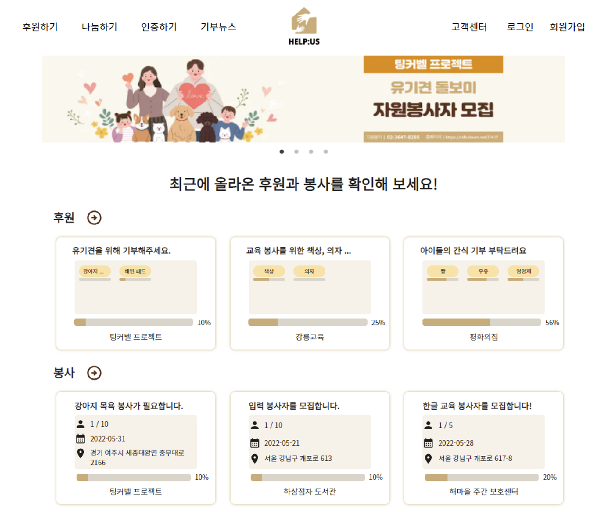

#                                            Help:us

<h3 align="center">
    투명한 기부와 봉사를 실천하고 싶은 사용자를 기관과 연결해주는 서비스
</h3>

## 📖 프로젝트 기획 의도 및 배경

불우한 사람들을 돕기위한 기부금을 중간에 횡령하는 사건이 빈번하게 발생해 뉴스에 나오곤 합니다. 많은 기부 사이트가 현금을 주로 받고 있어서 기부금 사용내역과 실제 사용했는지 여부를 쉽게 조작할 수가 있기 때문에 발생한 문제라고 생각합니다. 그래서 투명한 기부에 대한 필요성을 느꼈고, 이를 위해 헬프어스 사이트를 통해 물품을 직접 구매를 하고 기관에 바로 보내서 기부금 횡령을 방지하는 방향을 생각했습니다. 

## ✨ 프로젝트 소개

투명한 기부를 위한 여려가지 절차를 모든 사용자가 쉽게 이용할 수 있도록 서비스를 제공하고, 봉사자와 기관을 연결해주는 매개체 역할을 하는 사이트입니다.

일반 사용자는 기부하고 싶은 기관을 검색해 기관에서 필요한 물품들을 기부 요청글을 통해 확인하고 인터넷 쇼핑으로 물품을 구배해 바로 기관으로 보낼 수 있습니다. 택배를 기관측에서 확인하면 기부 확인서 또한 발급가능합니다.

## 🌿 개발 기간 및 팀원

- 개발 기간 : 2022.04.11 ~ 2022.05.20
- 개발 인원 : Frontend 3명, Backend 3명
  - FE : 이다예, 김나영, 이제민
  - BE : 최다운, 박소희, 이명원

## ⚒️ 기술 스택

- Front-end
  
    `React` `Next.js` `Typescript` 
    
- Back-end
  
    `SpringBoot` `Gateway` `JPA`
    
- DB
  
    `MySQL` `S3`
    
- Deploy
  
    `AWS EC2` `Jenkins CI/CD`

## 🔖 담당했던 Part

게시글과 댓글, 대댓글 CRUD를 담당하였습니다. 

- 서버와의 API 연동을 통해 데이터를 불러와 useState로 상태 관리를 하였습니다.
- 게시글 카테고리는 필터링 처리하여 사용자가 원하는 정보를 쉽게 찾을 수 있게 구현하였습니다.
- 게시글 작성시 필요한 이미지는 fileReader를 사용해, 이미지 업로드 및 미리보기를 구현하였습니다.
- 댓글과 대댓글의 실시간 반영 및 추가를 위해 useEffect의 의존성 배열을 활용해 구현하였습니다.

### ✍️ 페이지별 상세 내용 : [바로가기](https://www.notion.so/dayelee/Help-us-512aa38abf114fb0b58995c19bbcca3c?pvs=4)
